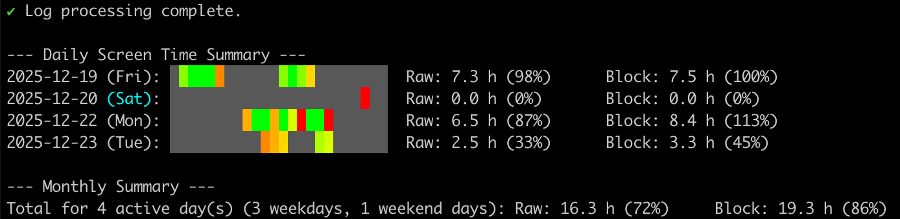

# Time Buddy

A simple to use time tracking CLI for **macOS**.

Track your screen time based on macOS system logs to calculate how many hours you've worked each day.



## Features

- 📊 Track screen time based on macOS unlock/lock events
- 📅 Calculate time spent per day with hourly breakdown visualization
- 💾 Smart caching for faster subsequent runs
- 🎨 Colorful terminal output with progress indicators

## Requirements

- macOS (uses macOS system logs)
- Python 3.7+ (for development)

## Setup (Required)

Before using Time Buddy, you must enable persistent logging for screen lock/unlock events:

```bash
sudo log config --subsystem com.apple.loginwindow --mode "persist:info"
```

This command configures macOS to persistently store login window events. Without this, the system may not retain the screen lock/unlock logs needed for accurate time tracking.

> **Note**: You only need to run this once. The setting persists across reboots.

## Installation

### Quick Install (Recommended)

```bash
curl -fsSL https://raw.githubusercontent.com/alen-z/time-buddy/main/install.sh | bash
```

### Build from Source

```bash
# Clone the repository
git clone https://github.com/alen-z/time-buddy.git
cd time-buddy

# Install dependencies and build
make install
make install-binary
```

## Usage

```bash
# Show screen time for the last 7 days (default)
time-buddy

# Show screen time for the last 30 days
time-buddy --days 30

# Show detailed session information
time-buddy --verbose

# Force refresh (ignore cache)
time-buddy --no-cache

# Include weekends in expected hours calculation
time-buddy --include-weekends

# Clear the cache
time-buddy --clear-cache
```

## Development

```bash
# Install dependencies
make install

# Run the application
make run

# Create standalone binary
make create-binary

# Test the binary
make test-binary

# Clean build artifacts
make clean
```

## How It Works

Time Buddy reads macOS system logs for screen lock/unlock events and calculates:

- **Raw time**: Actual screen-on time between unlock and lock events
- **Block time**: Time span from first to last activity (your "work block")

The output shows a 24-hour visualization where each block represents an hour, colored by activity intensity.

## License

MIT License
